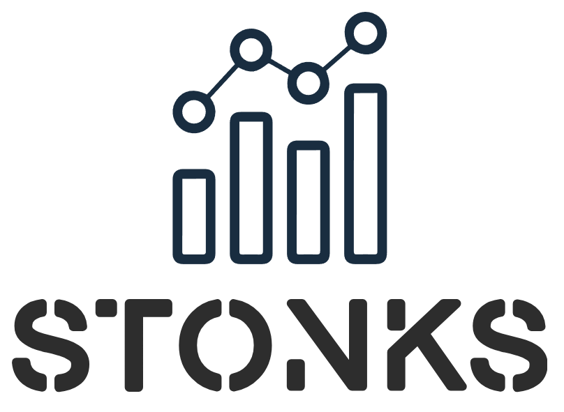
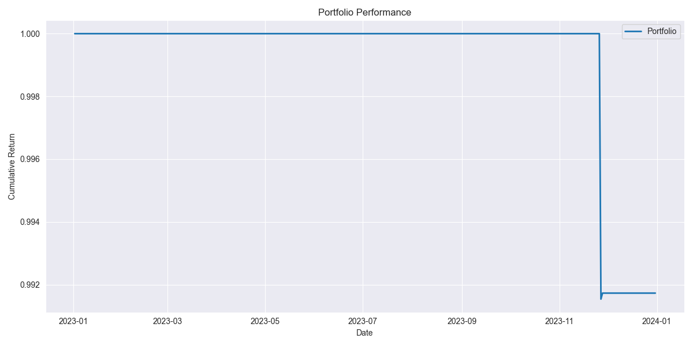
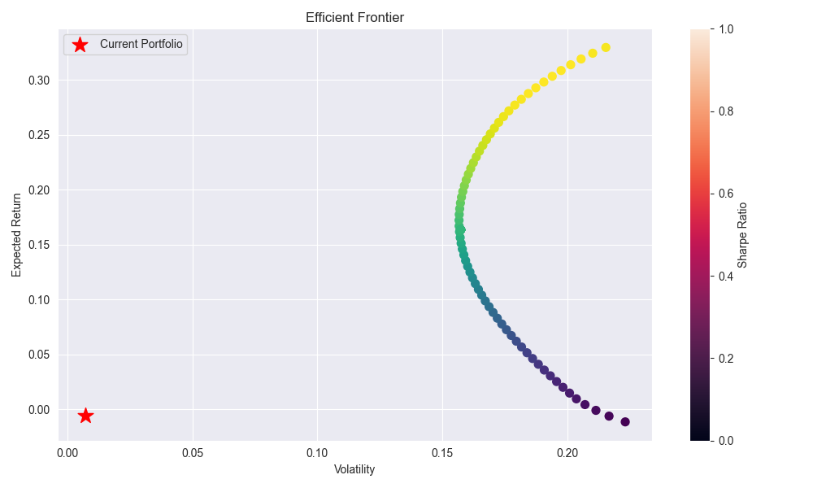
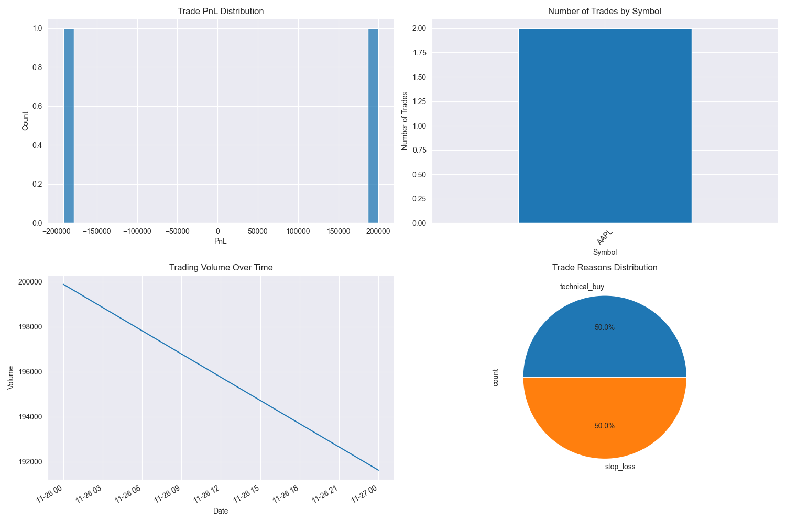
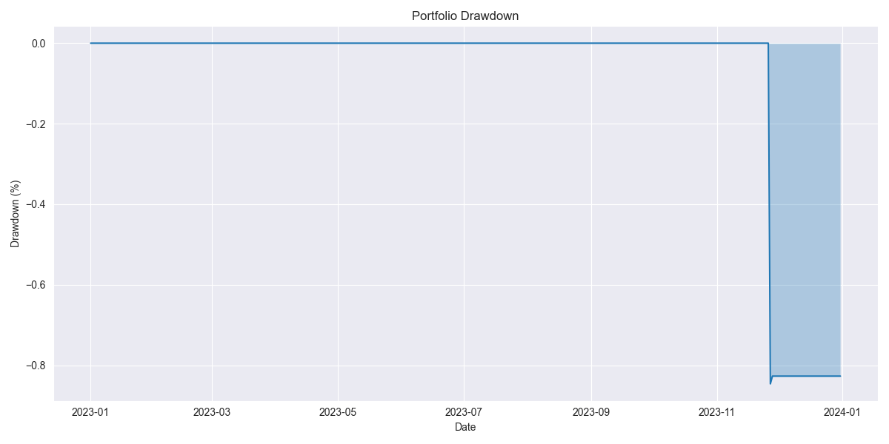

# Stonks: Advanced Financial Machine Learning Platform

<p align="center">
  
</p>

## Overview
Stonks is a comprehensive machine learning infrastructure for advanced financial data analysis and predictive trading strategies. The platform leverages state-of-the-art deep learning models, real-time market data processing, and production-grade deployment infrastructure.

## Features
- 🧠 Advanced ML Models
  - LSTM, Transformer, WaveNet architectures
  - Graph Neural Networks (GNN)
  - Custom attention mechanisms
  - Transfer learning capabilities

- 📊 Market Analysis
  - Real-time data processing
  - Technical indicators
  - Signal generation
  - Feature engineering pipeline

- 🚀 Production Infrastructure
  - Containerized deployment
  - Auto-scaling capabilities
  - Health monitoring
  - A/B testing framework

- 🔒 Security Features
  - Automated security scanning
  - Access control
  - Secure model registry
  - Input validation

## Prerequisites
- Python 3.13.0
- Docker & Docker Compose
- AWS CLI
- Terraform >= 1.0.0

## Quick Start
1. Clone the repository:
```bash
git clone https://github.com/yourusername/stonks.git
cd stonks
```

2. Install dependencies:
```bash
pip install -r requirements.txt
pre-commit install
```

3. Set up environment variables:
```bash
cp .env.example .env
# Edit .env with your configuration
```

4. Run development server:
```bash
docker-compose up -d
```

## Development
### Code Quality
We use several tools to maintain code quality:
- Black for code formatting
- isort for import sorting
- MyPy for type checking
- Bandit for security scanning
- Pre-commit hooks for automated checks

### Testing
Run tests with:
```bash
pytest
```

View coverage report:
```bash
pytest --cov=backend --cov-report=html
```

## Deployment
### Infrastructure
We use Terraform for infrastructure management:
```bash
cd infrastructure
terraform init
terraform plan -var="environment=staging"
terraform apply -var="environment=staging"
```

### CI/CD Pipeline
Our GitHub Actions pipeline handles:
1. Automated testing
2. Security scanning
3. Docker image building
4. Staged deployments
5. Monitoring alerts

### Monitoring
- Prometheus for metrics collection
- Grafana for visualization
- Custom dashboards for:
  - Model performance
  - System health
  - Request metrics
  - Resource utilization

## Architecture
### Components
1. Model Training Infrastructure
   - GPU optimization
   - Distributed training
   - Model versioning

2. Serving Infrastructure
   - RESTful API
   - Real-time predictions
   - Load balancing
   - Auto-scaling

3. Monitoring Stack
   - Health checks
   - Performance metrics
   - Alert system
   - Logging

## Contributing
1. Fork the repository
2. Create feature branch
3. Commit changes
4. Push to branch
5. Create Pull Request

## Security
Report security vulnerabilities to security@yourdomain.com

## License
This project is licensed under the MIT License - see LICENSE file for details.

## Support
For support, email support@yourdomain.com

## Roadmap
See ROADMAP.md for future development plans.

## Market Data Providers 

The system supports multiple market data providers with intelligent failover, health monitoring, and comprehensive management capabilities:

### Features
- Advanced Provider Management:
  * Real-time health monitoring dashboard
  * Automated provider failover based on health metrics
  * Predictive health analysis with anomaly detection
  * Comprehensive provider management console
  * Priority-based provider selection
- Resilient Error Handling:
  * Circuit breaker pattern implementation
  * Intelligent retry logic with backoff
  * Rate limiting and backpressure handling
  * Comprehensive error tracking
- Performance Optimization:
  * Real-time metrics collection and analysis
  * Latency monitoring and optimization
  * Cache management with TTL support
  * Memory-aware operation
- Health Monitoring:
  * Real-time health status tracking
  * Metric history and trend analysis
  * Anomaly detection and alerting
  * Performance forecasting
  * Event timeline tracking

### Supported Providers
- Alpha Vantage (Production)
- Yahoo Finance (Production)
- Mock Provider (Testing/Development)

### Management Console
The provider management console offers:
- Real-time provider status monitoring
- Add/Edit/Delete provider functionality
- Start/Stop controls
- Priority management
- Health status visualization
- Configuration management
- Performance analytics

### Configuration
Market data providers can be configured using the `MarketDataConfig` class:

```python
config = MarketDataConfig(
    credentials=MarketDataCredentials(api_key="your_key"),
    base_url="provider_url",
    websocket_url="ws_url",
    request_timeout=1,  # seconds
    max_retries=3
)
```

### Usage Example
```python
# Initialize provider
provider = MockProvider(config)
await provider.connect()

# Subscribe to symbols
await provider.subscribe(["AAPL", "MSFT"])

# Get historical data
df = await provider.get_historical_data(
    symbol="AAPL",
    start_date=datetime.now() - timedelta(days=7),
    interval="1h"
)

# Get real-time quotes
quote = await provider.get_quote("AAPL")

# Get symbol statistics
stats = await provider.get_symbol_stats("AAPL")
```

## Tech Stack

### Backend
- Language: Python 3.13.0
- Framework: FastAPI
- Database: SQLAlchemy with SQLite
- Authentication: JWT-based with python-jose
- WebSocket support for real-time data
- Email integration with fastapi-mail
- Machine Learning:
  - TensorFlow/Keras for deep learning
  - scikit-learn for ensemble models
  - statsmodels for statistical analysis
  - arch for volatility modeling
- Trading System:
  - Asynchronous execution engine
  - Risk-aware order management
  - Real-time portfolio monitoring
  - Automated rebalancing

### Frontend
- Framework: React
- State Management: Redux Toolkit
- UI Components: Material-UI
- Charts: TradingView Lightweight Charts
- Technical Analysis: technicalindicators library

### Infrastructure
- Containerization: Docker & Docker Compose
- CI/CD: GitHub Actions
- Infrastructure as Code: Terraform
- Cloud Provider: AWS (ECS Fargate)
- Monitoring: Prometheus & Grafana
- Logging: CloudWatch

### Data Sources & APIs
- Yahoo Finance (yfinance)
- Market data providers
- Financial analysis APIs

### DevOps & CI/CD
- GitHub Actions for automated testing and deployment
- Docker containerization
- Code quality tools (black, isort, mypy)
- Security scanning (bandit, safety)
- Pre-commit hooks

## Setup & Installation

1. Clone the repository:
```bash
git clone https://github.com/yourusername/stonks.git
cd stonks
```

2. Install Python dependencies:
```bash
python -m venv venv
source venv/bin/activate  # On Windows: .\venv\Scripts\activate
pip install -r requirements.txt
pre-commit install
```

3. Install Node.js dependencies:
```bash
cd frontend
npm install
```

4. Set up environment variables:
Create a `.env` file in the root directory:
```env
# Database
DATABASE_URL=sqlite:///./stonks.db
# Security
SECRET_KEY=your_secret_key
ACCESS_TOKEN_EXPIRE_MINUTES=30
# Email
MAIL_USERNAME=your_email
MAIL_PASSWORD=your_password
MAIL_SERVER=smtp.gmail.com
MAIL_PORT=587
# AWS (for production)
AWS_ACCESS_KEY_ID=your_aws_key
AWS_SECRET_ACCESS_KEY=your_aws_secret
AWS_REGION=us-west-2
# Monitoring
PROMETHEUS_PUSHGATEWAY=http://localhost:9091
```

5. Initialize the database:
```bash
cd backend
python init_db.py
```

6. Run the development servers:

Backend:
```bash
uvicorn main:app --reload --port 8000
```

Frontend:
```bash
cd frontend
npm start
```

7. (Optional) Run with Docker:
```bash
docker-compose up -d
```

## Deployment

### Local Development
```bash
docker-compose up -d
```

### Production Deployment
1. Configure AWS credentials:
```bash
aws configure
```

2. Deploy infrastructure:
```bash
cd infrastructure
terraform init
terraform plan -var="environment=production"
terraform apply -var="environment=production"
```

3. Push to main branch to trigger deployment:
```bash
git push origin main
```

## API Documentation

The API documentation is available at `/docs` or `/redoc` when running the backend server.

## Project Structure

```
stonks/
├── .github/
│   └── workflows/          # GitHub Actions workflows
├── backend/
│   ├── models/            # Database models
│   ├── routers/          # API route handlers
│   ├── services/         # Business logic
│   ├── tests/           # Test suite
│   └── utils/           # Helper functions
├── frontend/
│   ├── src/
│   │   ├── components/  # React components
│   │   ├── redux/      # State management
│   │   ├── services/   # API clients
│   │   └── utils/      # Helper functions
│   └── public/         # Static assets
├── infrastructure/      # Terraform configurations
├── monitoring/         # Prometheus & Grafana configs
└── docs/              # Documentation
```

## Contributing

1. Fork the repository
2. Create a feature branch
3. Commit your changes
4. Push to the branch
5. Create a Pull Request

## Security

- JWT-based authentication
- Password hashing with bcrypt
- WebSocket authentication
- Environment variable management
- Input validation
- Permission-based access control
- Automated security scanning
- Infrastructure security groups
- AWS IAM roles and policies

## License

[MIT License](LICENSE)

## Acknowledgments

- TradingView for the Lightweight Charts library
- FastAPI for the excellent framework
- Material-UI for the component library

## Screenshots





